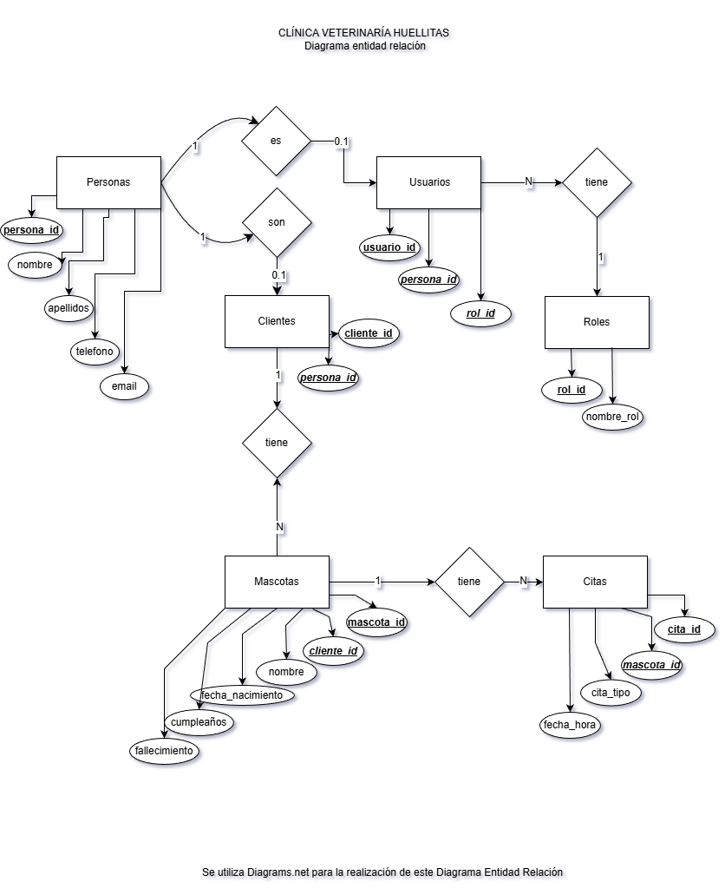
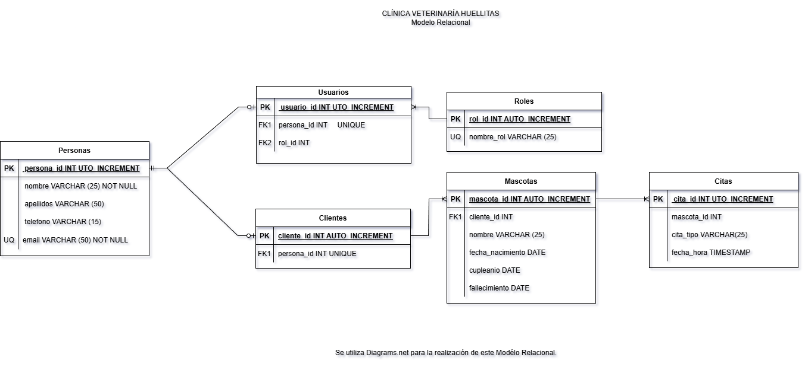

## Listado de entidades.
 
 ### personas **(ED)**
 - persona_id **(PK)**
 - nombre 
 - apellidos
 - telefono
 - email

  ### usuarios **(ED)**
 - usuario_id **(PK)**
 - persona_id **(FK)**
 - rol_id **(FK)**

 ### clientes **(ED)**
 - cliente_id **(PK)**
 - persona_id **(FK)** 

 ### roles **(EC)**
 - rol_id **(PK)**
 - nombre_rol

 ### mascotas **(ED)**
 - mascota_id **(PK)**
 - nombre
 - fecha_nacimiento
 - fallecimiento
 - cliente_id  **(FK)**

 ### citas **(EA)**
 - cita_id **(PK)**
 - cita_tipo
 - fecha_hora
 - mascota_id  **(FK)**

## Relaciones
1. Las **personas** son **usuarios** (_1 - 0..1_).
2. La **persona** es **cliente** (_1 - 0..1_).
3. Los **roles** tienen **usuarios** (_1 - N_).
4. Los **clientes** tienen **mascotas** (_1 - N_).
5. Las **mascotas** tienen **citas** (_1 - N_).

## Diagramas 
 
### Modelo Entidad Relación de la base de datos.

### Modelo Relacional de la base de datos.

## Reglas de negocio (CRUD)

### personas **(ED)**
1. Crear una persona.
2. Leer todas las personas.
3. Leer una persona.
4. Actualizar una persona.
5. Eliminar una persona.

### usuarios **(ED)**
1. Crear un usuario.
2. Leer todos los usuarios.
3. Leer un usuario.
4. Actualizar un usuario.
5. Actualizar datos de un usuario.
6. Eliminar un usuario.

### clientes **(ED)**
1. Crear un cliente.
2. Leer todos los clientes.
3. Leer un cliente.
4. Actualizar un cliente.
5. Eliminar un cliente.

## roles  **(EC)**
1. Crear un rol.
2. Leer todos los roles.
3. Leer un rol.
4. Actualizar un rol.
5. Eliminar un rol.

### mascotas **(ED)**
1. Crear una mascota.
2. Leer todos las mascotas.
3. Leer una mascota.
4. Actualizar una mascota.
5. Eliminar una mascota.

### citas **(EA)**
1. Crear una cita.
2. Leer todas las citas.
3. Leer una cita.
4. Actualizar una cita.
5. Eliminar una cita.

