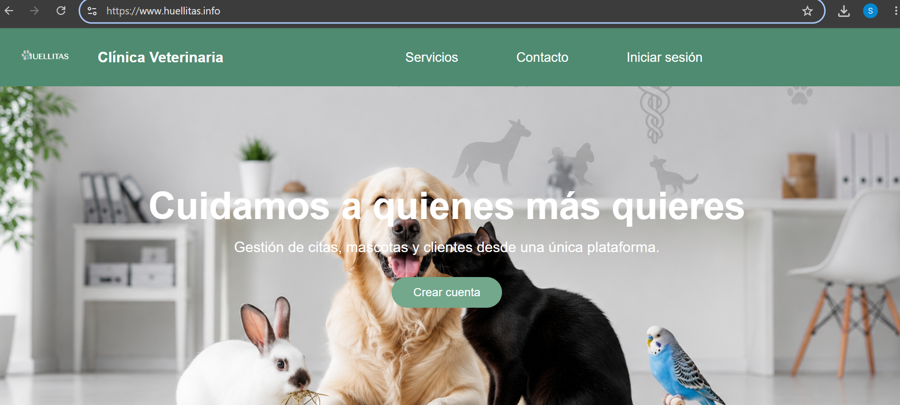

# Clínica Veterinaria Huellitas



## Aplicación en producción

https://www.huellitas.info

> Aplicación desarrollada como Trabajo de Fin de Ciclo del Grado Superior de Desarrollo de Aplicaciones Web (DAW).

---

## Descripción del proyecto

Clínica Veterinaria Huellitas es una aplicación web desarrollada para la gestión integral de una clínica veterinaria.

El proyecto permite administrar clientes, mascotas y citas veterinarias mediante una plataforma centralizada accesible desde Internet. Su desarrollo ha seguido una metodología estructurada que abarca todas las fases del ciclo de vida de una aplicación: análisis, diseño, desarrollo, pruebas, despliegue y documentación.

---

## Funcionalidades principales

### Gestión de usuarios

* Registro de nuevos usuarios.
* Inicio de sesión.
* Gestión de perfiles.

### Gestión de mascotas

* Alta y consulta de mascotas.
* Asociación de mascotas a sus propietarios.
* Gestión de información veterinaria.

### Gestión de citas

* Solicitud de citas.
* Consulta de citas programadas.
* Seguimiento del estado de las citas.

### Área administrativa

* Gestión centralizada de usuarios.
* Gestión de mascotas.
* Administración de citas veterinarias.

---

## Arquitectura de la aplicación

La aplicación ha sido desarrollada siguiendo el patrón Modelo-Vista-Controlador (MVC).

```text
JSP (Vista)
    ↓
Servlets (Controladores)
    ↓
Servicios (Lógica de negocio)
    ↓
DAO (Acceso a datos)
    ↓
Oracle Database
```

---

## Tecnologías utilizadas

### Backend

* Java 17
* Servlets
* JSP
* JDBC

### Frontend

* HTML5
* CSS3
* JavaScript

### Base de datos

* Oracle Database 21c Express Edition

### Servidor de aplicaciones

* Apache Tomcat 10

### Herramientas de desarrollo

* Eclipse IDE
* Oracle SQL Developer
* Git
* GitHub

---

## Despliegue

La aplicación ha sido desplegada en un entorno real utilizando:

* VPS con Windows Server 2022.
* Apache Tomcat 10.
* Oracle Database 21c XE.
* Dominio público propio.
* Acceso remoto para administración y mantenimiento.

---

## Documentación del proyecto

### Documentación técnica

* Modelado de datos.
* Lógica de negocio.
* Diagramas de arquitectura.
* Diagramas entidad-relación.

### Memoria y presentación

La documentación completa del Trabajo de Fin de Ciclo se encuentra disponible en el repositorio junto con los diagramas y recursos utilizados durante el desarrollo.

[📄 Descargar memoria del TFG](docs/Memoria_TFG_Huellitas.pdf)

---

## Autor

Sandra Marín

Trabajo de Fin de Ciclo (DAW)

2026
